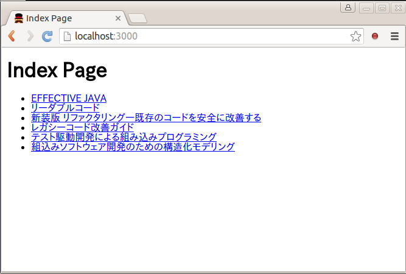
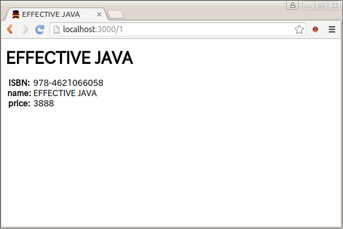
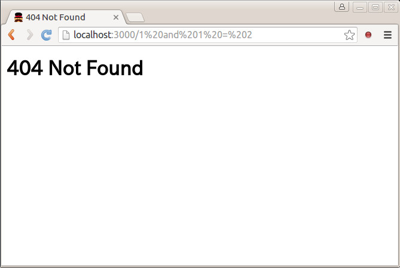

# Blind SQL Injection
Blind SQL Injectionの解説スライドと、実際の攻撃デモのためのアプリのセット。

* [Blind SQL Injection スライド](http://masakura.github.io/blind/)
* SQL Injection が存在するアプリ
* Blind SQL Injection でテーブル名を調査クラックツール


## スライドを見る
[Blind SQL Injection スライド](http://masakura.github.io/blind/)を見てください。


## デモを実行する
* Node.js 4.2 or higher


### セットアップ
```
git clone https://github.com/masakura/blind.git
cd blind
npm install
bower install
```


### アプリの起動
```
npm run server
```

起動をしたら、`http://localhost:3000/` にアクセスしてください。





書籍情報の `http://localhost:3000/1` に SQL Injection の脆弱性があります! どのようなクエリが実行されたかはコンソールに表示されるのでそちらを見てください。

`http://localhost:3000/1%20and%201%20=%201` にアクセスすると...

```
RUN: select * from items where id = 1 and 1 = 1
```

`http://localhost:3000/1%20and%201%20=%202` にアクセスすると...

```
RUN: select * from items where id = 1 and 1 = 2
```



データベースは SQLite3 を利用していますので、[Query Language Understood by SQLite](https://www.sqlite.org/lang.html) をみて色々チャレンジしてください。


#### テーブル名一覧
このアプリには `users`・`items` という二つのテーブルがありますが、それ以外にランダムな名前のテーブルをいくつか生成しています。


### テーブル名を調査する
```
npm run crack
```

テーブル名を一文字ずつ調査していくツールです。アルファベット・数字・アンダースコアの組み合わせでテーブルがあるかどうかをちまちまと調査します。

```
> blind-sql-injection@1.0.0 crack /home/masakura/ドキュメント/repos/masakura/blind
> node app/crack.js

i*
it*
ite*
item*
items*
p*
```

* `*` は 0 文字以上の任意の文字の繰り替えしなので、結果を目視しないとテーブル名が分かりません
* アルゴリズムが力技なのでとっても遅いです
* デモ用ならこれで十分かなと...
